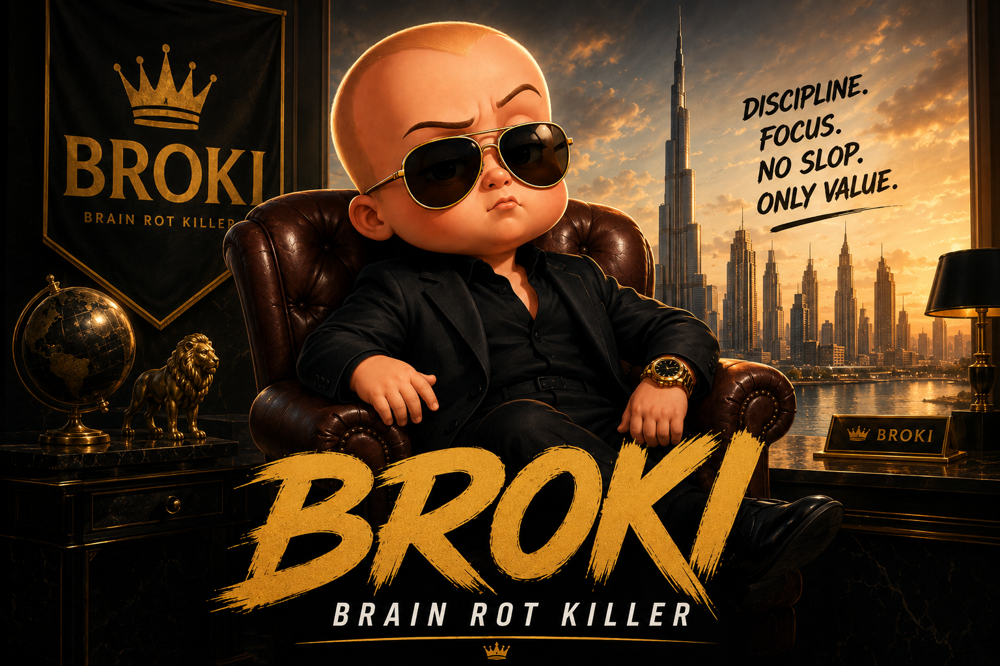

# BROKI — Brain Rot Killer

**BROKI** is a tool that reviews and supervises media content for kids of the next generation.

---

## Contents

- [What is this?](#what-is-this)
- [What is actually happening](#what-is-actually-happening)
- [Flow](#flow)
- [Privacy boundary](#privacy-boundary)
- [Run it](#run-it)
- [Built with](#built-with)
- [Resources](#resources)

---

## What is this?

**BROKI** ingests a video stream, scores each item with a TRIBE-derived engagement proxy, and renders cortical-surface "brain" frames on the fsaverage5 template. When engagement crosses a local threshold, an optional local vision-language model fires a short risk summary to determine the quality of the content being viewed. Caregivers see the frame, the score, the summary and rationale, and a binary approve or disapprove override.

Everything stays local without leaking your data.

---

## What is actually happening

**BROKI** consumes a media playlist, hashes and segments each file, runs a TRIBE v2 predictor on the now-playing representative windows, and writes the activation field to disk as a PNG brain frame. A small FastAPI server exposes a review console that walks caregivers through the queue, lets them approve or disapprove each item, and updates the local threshold policy in place.

Skip behavior is simulated locally, so nothing about a child's actual viewing habits is ever observed. No network calls happen unless you explicitly opt in to a cloud VLM provider via environment variables, and even then the only data leaving the machine is a scrubbed payload that has already been stripped of local file paths.

The predictor and the renderer are decoupled from the review console. You can run the demo end-to-end on a fresh folder, or you can point the server at an existing SQLite database and pick up exactly where a previous session left off. Artifacts such as brain frames, scratch JSON, and the VLM cache live under a single artifacts directory, so the data layout stays easy to inspect and easy to wipe.

## Flow

| Stage | What it does | Why it matters |
|---|---|---|
| ingest | Scan the media directory and compute duration via ffprobe. | You keep full control of the source folder. |
| predict | Run the TRIBE v2 predictor on representative windows. | Per-segment engagement is grounded, not a single guess. |
| render | Plot the activation field onto the fsaverage5 cortical surface. | A real frame artifact, not a scalar heatmap bar. |
| gate | Compare predicted engagement against a local threshold. | Cheaper signals gate the expensive ones. |
| decide | Fire the optional VLM risk summary only when the gate opens. | Cloud calls stay behind a local engagement gate. |
| learn | Update the threshold policy from binary caregiver feedback. | No child telemetry — the caregiver's call is the only one. |
| show | Serve the review console so the caregiver can approve or disapprove. | Humans stay in the loop for every warning. |

## Privacy boundary

- No YouTube integration of any kind: no scraping, no metadata, no thumbnails.
- No browser inspection, history scraping, or extension hooks.
- No OS screen capture, process telemetry, or keystroke logging.
- No child telemetry: no gaze tracking, no clicks, no pauses, no scroll depth, no watch retention, and no biometrics of any kind.
- Caregiver feedback is strictly binary: approve or disapprove.
- Caregiver feedback is stored only in the local SQLite database that ships with the project.
- Local file paths are scrubbed before any optional VLM payload is built, so even with the gate open, the cloud side never sees where the media lives.
- Skip recommendations are simulated locally and never trigger any OS-level block.

## Run it

~~~bash
# Install
pip install -e backend/

# Generate demo artifacts
PYTHONPATH=backend python -m brainrot_guard demo \
  --media-dir /tmp/brainrot-media \
  --db-path /tmp/brainrot-guard/state.sqlite3 \
  --artifacts-dir /tmp/brainrot-guard/artifacts

# Serve the review console
PYTHONPATH=backend python -m brainrot_guard serve \
  --db-path /tmp/brainrot-guard/state.sqlite3 \
  --media-dir /tmp/brainrot-media \
  --artifacts-dir /tmp/brainrot-guard/artifacts \
  --host 127.0.0.1 \
  --port 8787

# Audit the readiness proof
PYTHONPATH=backend python -m brainrot_guard validate-readiness \
  --db-path /tmp/brainrot-guard/state.sqlite3 \
  --media-dir /tmp/brainrot-media \
  --artifacts-dir /tmp/brainrot-guard/artifacts

# Audit the local caregiver calibration dataset
PYTHONPATH=backend python -m brainrot_guard validate-calibration \
  --db-path /tmp/brainrot-guard/state.sqlite3
~~~

Then open `http://127.0.0.1:8787` in a browser on the same machine. The `demo` command populates the database with a representative fixture so the review console has something to walk through even before you point it at your own media.

`validate-readiness` prints a consolidated JSON checklist for local media, tool, TRIBE/PlotBrain, target GPU, VLM provider, and caregiver-learning proof status. Live TRIBE, GPU, PlotBrain smoke rendering, and credentialed VLM probes remain opt-in via that command's flags. `validate-calibration` audits the real local caregiver feedback examples in SQLite and reports whether there are enough balanced approve/disapprove examples across segment-response and full-decomposition feature scopes for personalization.

When you have saved JSON output from `validate-analysis` or `validate-browser`, pass it back with `--analysis-report-json` or `--browser-report-json` so `validate-readiness` can mark those proof gates complete. The readiness checker validates the expected proof fields instead of accepting a bare `{"ready": true}` report.

Likewise, saved output from `validate-vlm-live --probe` can be passed with `--vlm-report-json`. The report must include the selected provider/model, redacted endpoint, engagement threshold, and normalized probe result.

## Built with

| Category | Tools |
|---|---|
| Backend | Python 3.11+, FastAPI, Uvicorn, Pydantic, pydantic-settings |
| ML / data | TRIBE v2 predictor, PlotBrain (fsaverage5), NumPy, scikit-learn, SciPy |
| Media I/O | ffprobe-python, Mutagen, Pillow, ffmpeg static |
| VLM | xAI, Gemini, MiniCPM-compatible HTTP, opt-in |
| HTTP | httpx, python-multipart |
| Persistence | SQLite |
| Testing | pytest, pytest-asyncio, pytest-mock, Playwright |
| Quality | Ruff |

## Resources

- [TRIBE v2 — Trimodal Brain Embedding, Meta AI blog](https://ai.meta.com/blog/tribe-v2-brain-predictive-foundation-model/)
- [Quantized TRIBE v2, `Jessylg27/tribev2-lite-qv`](https://huggingface.co/Jessylg27/tribev2-lite-qv)
- [MiniCPM-V 4.6, `openbmb/MiniCPM-V-4.6`](https://huggingface.co/openbmb/MiniCPM-V-4.6)

---

> Disclaimer: the "brain" frames are model-predicted proxies of neural response, not actual neural activity.
